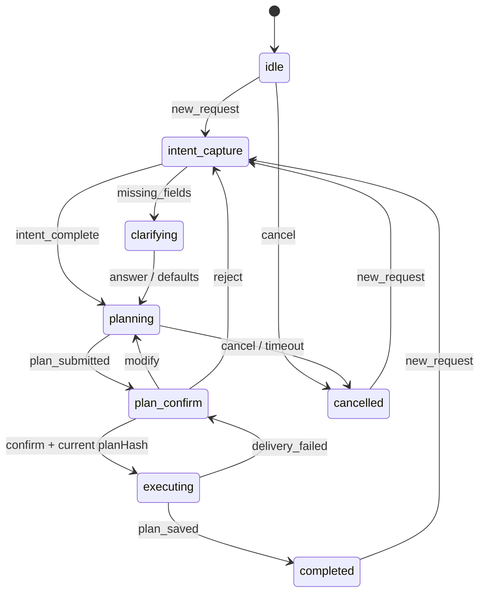
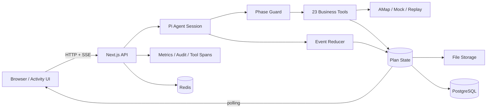

# Activity Agent

> 一个可审计、可评测、受状态机约束的本地活动规划 Agent。

[](https://github.com/qinxiushan/activity-agent/actions/workflows/ci.yml)
[](./LICENSE)


Activity Agent 基于 Pi Agent SDK 和 Next.js 构建。它可以理解日期、人数、预算、出发地和偏好，自动完成天气、地点、营业时间、路线与预算规划，并在用户确认后生成可下载的日历行程。

这个项目关注的不只是“模型能否给出答案”，还关注三个更难的问题：

- 模型能否始终按照业务流程执行，而不是偶尔跳步或越权调用工具；
- 外部数据、预算和路线结论能否追溯、降级和复现；
- Agent 的质量、安全性和资源消耗能否通过评测数据验证。

如果你正在研究 Agent 编排、工具调用治理、状态机、真实数据接入或 Agent Eval，这个仓库可以作为一个完整的工程参考。

## 为什么不是纯 Agent Loop

Prompt 可以告诉模型“先收集需求，再规划，最后确认”，但它不能保证模型每一次都照做。Activity Agent 将模型视为不确定的规划器，把工作流正确性放在服务端控制面：

- **8 阶段状态机**：显式管理 `idle → intent_capture → planning → plan_confirm → executing → completed` 等状态；
- **10 类领域事件**：所有状态变化统一进入纯函数 Reducer，避免工具自行修改流程；
- **23 工具权限矩阵**：每个工具只在允许的阶段执行，非法调用在工具主体运行前被拒绝；
- **单次追问、单次确认**：最多生成一次结构化追问卡片，完整方案只有一个确认点；
- **版本化确认**：确认请求携带 `planHash`，方案变化后旧确认自动失效；
- **服务端规范产物**：时间轴和预算通过 token 关联服务端校验结果，避免模型改写已验证数据。



## 核心能力

### 受控的 Agent 编排

工具调用入口、Reducer 状态迁移和关键工具业务自检组成三层工作流防线：

1. **工具入口门禁**根据当前阶段和白名单，在执行前拒绝越权调用；
2. **Reducer 迁移校验**确保业务事件只能沿合法状态边流转；
3. **关键工具自检**继续校验 planHash、幂等键、validation token 和 budget token。

默认使用安全的 `phase_gated` 策略。仅供隔离评测的 `observe_only` 策略在生产环境中会被拒绝。

### 真实规划，而不只是生成一段文字

- 高德地图或本地 Mock 数据源；
- 地理编码、关键词/周边 POI 搜索和批量详情补全；
- 候选去重、历史方案排除和多样性重排；
- 步行、公交、驾车、骑行路线比较；
- 多点距离矩阵和访问顺序建议；
- 营业时间、时间窗口、通勤和缓冲时间校验；
- 人均/整段费用语义、未知价格区间和预算预留；
- 用户确认后生成 ICS 日历与可信导航/订位入口。

项目不会把平台跳转链接描述成“已经预订”，也不会伪造订单确认码。

### 可观测、可复现、可评测

- SSE 输出消息、工具调用和状态变化；
- 工具级耗时、重试、fallback 和 orphan span 追踪；
- Prometheus 指标与预置 Grafana Dashboard；
- File/PostgreSQL 双存储后端和 Redis 限流；
- 可回放外部数据 fixture；
- 硬规则评分、轨迹评分、成对偏好评测和 A/B 控制消融。

## 系统架构



核心原则：LLM 负责理解和规划，代码负责权限、状态、数据完整性和副作用边界。

## 23 个业务工具

| 类别 | 工具 |
| --- | --- |
| 意图与路由（4） | `classify_turn`、`intent_parse`、`ask_clarification`、`detect_user_region` |
| 地点与天气（10） | `geocode`、`reverse_geocode`、`get_weather`、`discover_place_candidates`、`search_places_text`、`search_places_nearby`、`get_place_details`、`search_activities`、`search_restaurants`、`check_opening_hours` |
| 路线与约束（5） | `compute_route`、`compare_route_options`、`distance_matrix`、`validate_itinerary`、`calculate_budget` |
| 提交与持久化（4） | `submit_plan`、`commit_itinerary`、`plan_save`、`plan_load` |

## 快速开始

### 环境要求

- Node.js `>= 20.9.0`，推荐 Node.js 22；
- npm；
- 一个 Pi Agent SDK 支持的模型及对应 API Key；
- PostgreSQL、Redis 和高德 API Key 均为可选项，本地默认可以使用文件存储和 Mock 数据。

### 1. 安装并配置项目

```bash
git clone https://github.com/qinxiushan/activity-agent.git
cd activity-agent
npm ci
cp .env.example .env
```

`.env` 默认配置为 `STORAGE_BACKEND=file` 和 `DATA_SOURCE=mock`，无需启动数据库即可体验主要流程。

### 2. 配置模型

Pi Agent SDK 从以下文件读取默认模型和凭证：

```text
~/.pi/agent/settings.json
~/.pi/agent/auth.json
~/.pi/agent/models.json   # 仅自定义 provider 需要
```

以 DeepSeek 为例：

`~/.pi/agent/settings.json`：

```json
{
  "defaultProvider": "deepseek",
  "defaultModel": "deepseek-v4-flash",
  "defaultThinkingLevel": "auto"
}
```

`~/.pi/agent/auth.json`：

```json
{
  "deepseek": {
    "type": "api_key",
    "key": "YOUR_API_KEY"
  }
}
```

保护凭证文件：

```bash
chmod 600 ~/.pi/agent/auth.json
```

不要把 API Key 写入仓库或提交到 Git。

### 3. 启动应用

```bash
npm run dev
```

打开：

- 活动规划界面：<http://localhost:30142/activity>
- 通用 Agent 界面：<http://localhost:30142/>
- 健康检查：<http://localhost:30142/api/health>

可以从下面的输入开始体验：

```text
帮我规划周六下午从北京三里屯出发的双人约会，18:00 前结束，
人均预算 300 元，偏好艺术展和安静的餐厅。
```

## 可选：完整基础设施

只启动本地 PostgreSQL 和 Redis：

```bash
npm run infra:up
```

启动 App、PostgreSQL、Redis、Prometheus 和 Grafana：

```bash
docker compose up -d --build
```

默认端口：

| 服务 | 地址 |
| --- | --- |
| Activity Agent | <http://localhost:30142> |
| PostgreSQL | `localhost:55432` |
| Redis | `localhost:56379` |
| Prometheus | <http://localhost:59090> |
| Grafana | <http://localhost:53000> |

容器内使用真实模型时，需要把 Pi 的配置文件放入 `pi-agent-home` volume，并确保运行用户有读取权限。

## 测试与评测

无需真实模型或高德额度的离线检查：

```bash
node_modules/.bin/tsc --noEmit
npm run test:smoke
npm run test:provider
npm run eval:quality
npm run test:eval:v1
npm run test:eval:v2
npm run test:eval:ab
```

当前主线离线基线：

| 检查 | 结果 |
| --- | ---: |
| Smoke | 388 / 388 |
| AMap Provider Contract | 20 / 20 |
| Eval V1 Contract | 43 / 43 |
| Eval V2 Contract | 32 / 32 |
| Agent Control A/B Contract | 11 / 11 |

真实模型端到端测试：

```bash
npm run e2e
```

### Agent Loop 与状态机 A/B

项目支持在同模型、同 Prompt、同工具契约下，对比只观察不拦截的 Agent Loop 与默认状态机：

```bash
# Terminal 1: phase-gated，端口 30142
npm run dev

# Terminal 2: observe-only，端口 30143
npm run dev:eval:loop

# Terminal 3: 配对运行
npm run eval:agent:ab -- \
  --loop-server http://localhost:30143 \
  --fsm-server http://localhost:30142 \
  --repetitions 3 \
  --output /tmp/activity-agent-ab.json
```

## 项目结构

```text
app/                    Next.js 页面与 HTTP/SSE API
components/activity/    阶段、追问、候选、时间轴和交付 UI
lib/plan-state.ts       8 阶段状态、工具权限和持久化管理
lib/plan-reducer.ts     领域事件与唯一状态迁移决策点
lib/workflow-control/   phase-gated / observe-only 控制策略
lib/eval/               回放、评分、配对指标和偏好评测
src/tools/              23 个业务工具及关键操作校验
src/prompts/            Activity Planner 系统提示词
evals/                  数据集、场景和可回放 fixture
scripts/                smoke、e2e、质量与 A/B 运行器
docker/                 Prometheus / Grafana 配置
```

## 当前边界

- 项目聚焦本地单日、短时活动规划，不是通用旅行预订平台；
- `commit_itinerary` 生成 ICS 和平台交接链接，不会代替用户付款或订位；
- Mock 数据只覆盖北京、上海和深圳；配置高德后可查询更多城市；
- 真实地图评测会消耗第三方 API 配额，优先使用 replay 或 Mock 完成回归；
- 项目仍处于持续演进阶段，部署前请根据业务要求补充密钥管理、备份和容量测试。

## Roadmap

- [ ] 为真实数据 A/B 增加逐 pair checkpoint、信号中断报告与断点续跑；
- [ ] 补充完全离线、fail-closed 的 A/B replay 数据集；
- [ ] 增加脱敏的完整规划演示 GIF 和 GitHub 社交预览图；
- [ ] 补充英文 README、贡献指南和 Issue 模板；
- [ ] 增加并发压测、P95/P99 延迟与成本基线。

## 参与项目

欢迎通过 [Issues](https://github.com/qinxiushan/activity-agent/issues) 提交问题、评测场景和设计建议，也欢迎提交 Pull Request。提交前请至少运行：

```bash
node_modules/.bin/tsc --noEmit
npm run test:smoke
npm run test:eval:v1
npm run test:eval:v2
npm run test:eval:ab
```

如果这个项目对你理解 Agent 编排、状态机约束或 Eval 有帮助，可以点一个 Star，方便以后回来查看，也能让更多在解决类似问题的人发现它。

## License

Copyright 2026 qinxiushan.

本项目基于 [Apache License 2.0](./LICENSE) 开源。你可以使用、修改和分发本项目，但需要保留许可证与版权声明，并标注对原始文件所做的重要修改。
